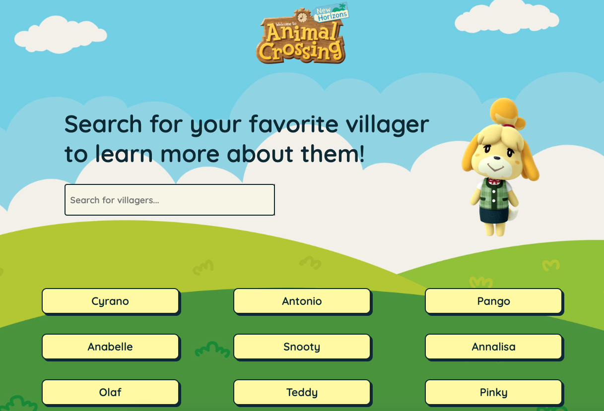
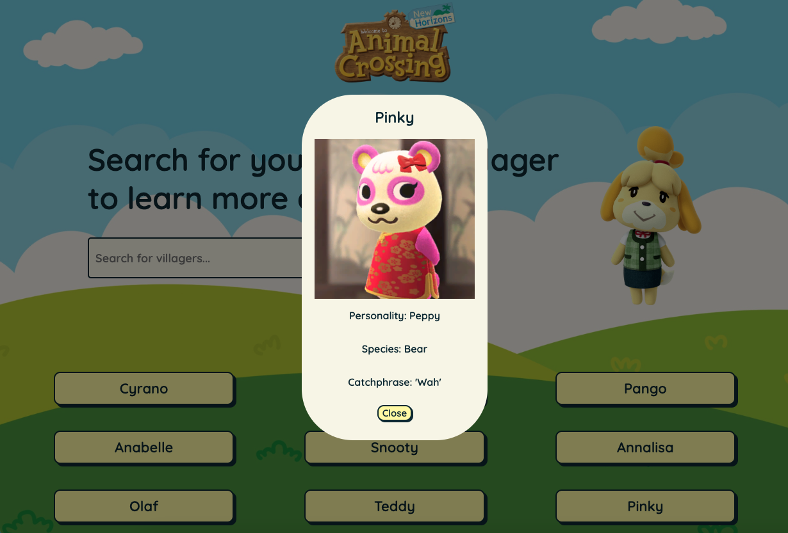
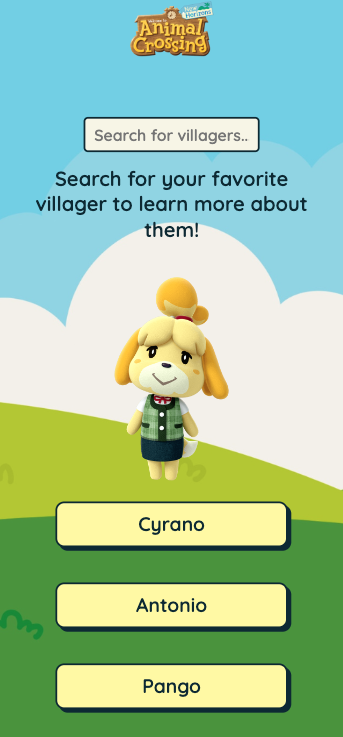
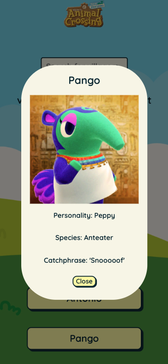

# Animal Crossing New Horizons App! 

## Description of project
This app features a list of 390 buttons with loaded data from a public API and a styled modal that pops up when you click on a villager. 

The project also includes a search bar to look for your favorite villagers. 

## Tech stack used: 
HTML, CSS, Javascript

## Link to the app: 
https://sammyweller.github.io/acnh-app/

## API: 
https://acnhapi.com/v1/villagers/

## Images of app: 

### Full desktop view of the app: 

### View of modal on desktop: 

### Mobile version of the app: 

### Modal on mobile: 

